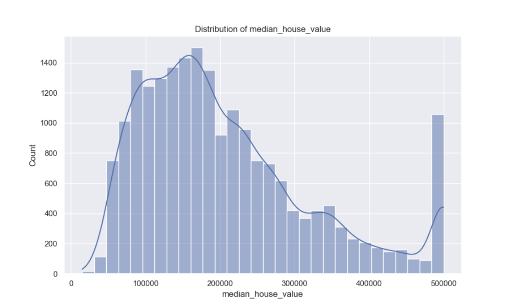
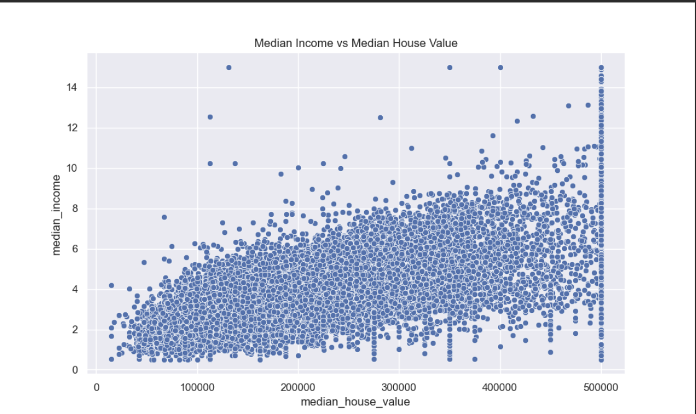
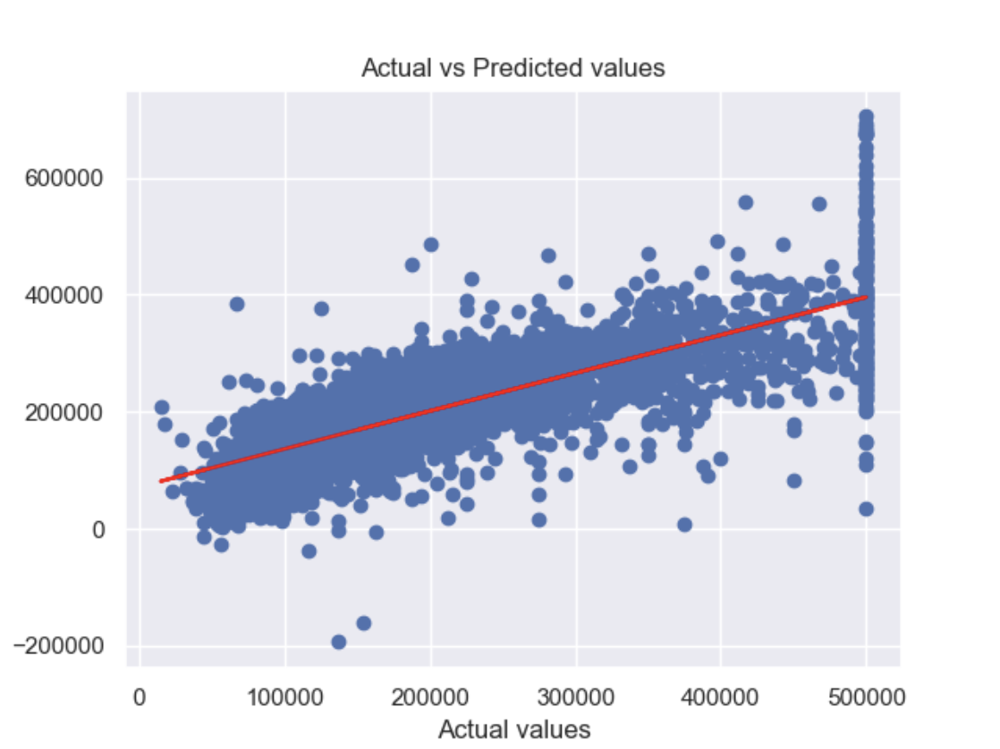
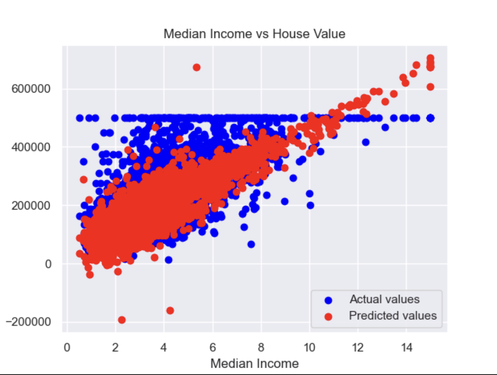

# HousePricingPrediction
Trying ML
## Data Loading & Preprocessing

First, it loads a dataset from a CSV file 'CAhousing.csv' into a pandas DataFrame.

It then separates the columns into numerical and categorical. This is necessary because numerical and categorical data are treated differently.

The missing values in the numerical columns are filled using the mean value of each respective column, and the missing values in categorical columns are filled using the mode (the most frequent value) of each respective column.

The distribution of the target variable, 'median_house_value', is visualized using a histogram.

The categorical feature 'ocean_proximity' is transformed into several binary features using one-hot encoding. One-hot encoding is a common way to handle categorical data in machine learning, as it allows us to convert categories into a format that can be provided to a machine learning model.

## Data Splitting & Standardization

The target variable ('median_house_value') is separated from the other features.

All the features, except the target, are standardized. Standardization is a common preprocessing step in machine learning which scales the data to have a mean of 0 and a standard deviation of 1. This is often done to ensure that all features have the same scale, which can be important for some machine learning algorithms.

The target is then appended back to the DataFrame.

The data is split into a training set and a test set. The training set is used to train the machine learning model, and the test set is used to evaluate its performance.

## Model Training & Evaluation

A linear regression model is instantiated and fitted using the training data.

The model is then used to make predictions on both the training data and the test data.

The mean squared error (MSE) of the predictions is calculated for both the training data and the test data. The MSE is a common metric for evaluating regression models and it quantifies the average squared difference between the predicted and actual values. The smaller the MSE, the better the model's predictions.

The output you're seeing, 'Training MSE' and 'Test MSE', are the MSE values for the training set and the test set, respectively. These values are quite large, indicating that the model's predictions are not very accurate, at least according to this metric. It's worth noting that the units of the MSE are the square of the units of the target variable, so it can sometimes be more interpretable to look at the root mean squared error (RMSE), which would be in the same units as the target variable.

